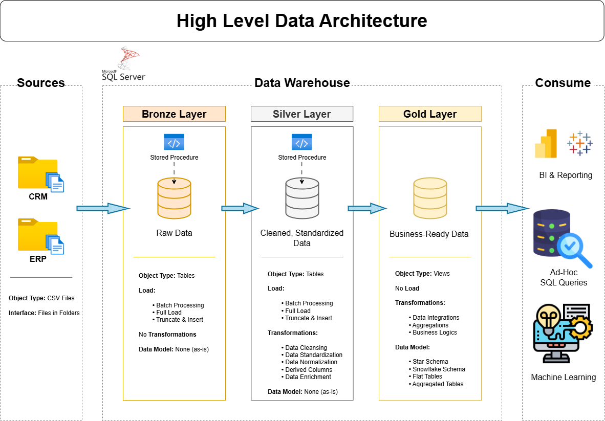

# 🎯 Data Warehouse and Engineering Project

Welcome to the **Data Warehouse and Engineering Project** repository! 🚀  
This project demonstrates a comprehensive data warehousing solution, from architecting a scalable SQL Data Warehouse from scratch to enabling data-driven decision-making. Designed as a portfolio project, it highlights industry best practices in **Data Engineering, ETL processing and Data Modeling**.

---

## 🏗️ Data Architecture

The data architecture for this project follows Medallion Architecture **Bronze**, **Silver**, and **Gold** layers:



1. **Bronze Layer**: Stores raw data as-is from the source systems. Data is ingested from CSV Files into SQL Server Database.
2. **Silver Layer**: This layer includes data cleansing, standardization, and normalization processes to prepare data for analysis.
3. **Gold Layer**: Houses business-ready data modeled into a star schema required for reporting and analytics.

---

## 📖 Project Overview

This project involves:

1. **Data Architecture**: Designing a Modern Data Warehouse Using Medallion Architecture **Bronze**, **Silver**, and **Gold** layers.
2. **ETL Pipelines**: Extracting, transforming and loading data from source systems into the warehouse.
3. **Data Modeling**: Developing fact and dimension tables optimized for analytical queries.
4. **Data Delivery**: Provisioning clean, aggregated datasets to support BI reporting and advanced analytics.

🎯 This repository is an excellent resource for professionals and students looking to showcase expertise in:
- Data Architect
- Data Engineering  
- ETL Pipeline Developer 
- SQL Development 
- Data Modeling  
- Analytics Engineering  

---

## 🛠️ Important Links & Tools:

Everything is for Free!

- **[Datasets](datasets/):** Access to the project dataset (csv files).
- **[SQL Server Express](https://www.microsoft.com/en-us/sql-server/sql-server-downloads):** Lightweight server for hosting your SQL database.
- **[SQL Server Management Studio (SSMS)](https://learn.microsoft.com/en-us/sql/ssms/download-sql-server-management-studio-ssms?view=sql-server-ver16):** GUI for managing and interacting with databases.
- **[Git Repository](https://github.com/):** Set up a GitHub account and repository to manage, version, and collaborate on your code efficiently.
- **[DrawIO](https://www.drawio.com/):** Design data architecture, models, flows, and diagrams.

---

## 🚀 Project Requirements

### Building the Data Warehouse (Data Engineering)

#### Objective
Develop a modern data warehouse using SQL Server to consolidate sales data, enabling analytical reporting and informed decision-making.

#### Specifications
- **Data Sources**: Import data from two source systems (ERP and CRM) provided as CSV files.
- **Data Quality**: Cleanse and resolve data quality issues prior to analysis.
- **Integration**: Combine both sources into a single, user-friendly data model designed for analytical queries.
- **Scope**: Focus on the latest dataset only; historization of data is not required.
- **Documentation**: Provide clear documentation of the data model to support both business stakeholders and analytics teams.

---

## 🗺️ Project Roadmap

### 1️⃣ Requirements Analysis 
- ✅ Analyze & Understand the Requirements

### 2️⃣ Design Data Architecture 
- ✅ Choose Data Management Approach
- ✅ Design the Layers
- ✅ Draw the Data Architecture (Draw.io)

### 3️⃣ Project Initialization 
- ✅ Create Detailed Project Tasks
- ✅ Define Project Naming Conventions
- ✅ Create Git Repo & Prepare The Repo Structure
- ✅ Create Database & Schemas

### 4️⃣ Build Bronze Layer 
- ✅ **Analyzing:** Source Systems
- ✅ **Coding:** Data Ingestion
- ✅ **Validating:** Data Completeness & Schema Checks
- ✅ **Document:** Draw Data Flow (Draw.io)
- ✅ **Commit:** Code in Git Repo

### 5️⃣ Build Silver Layer 
- ✅ **Analyzing:** Explore & Understand Data
- ✅ **Document:** Draw Data Integration (Draw.io)
- ✅ **Coding:** Data Cleansing
- ✅ **Validating:** Data Correctness Checks
- ✅ **Document:** Extend Data Flow (Draw.io)
- ✅ **Commit:** Code in Git Repo

### 6️⃣ Build Gold Layer 
- ✅ **Analyzing:** Explore Business Objects
- ✅ **Coding:** Data Integration
- ✅ **Validating:** Data Integration Checks
- ✅ **Document:** Draw Data Model of Star Schema (Draw.io)
- ✅ **Document:** Create Data Catalog
- ✅ **Document:** Extend Data Flow (Draw.io)
- ✅ **Commit:** Code in Git Repo

---

## 📂 Repository Structure

```
sql-data-warehouse-project/              # Repository Root
│
├── datasets/                            # Raw datasets (CRM and ERP source data)
│   ├── source_crm/                      # Source system: Customer Relationship Management
│   │   ├── cust_info.csv
│   │   ├── prd_info.csv
│   │   └── sales_details.csv
│   └── source_erp/                      # Source system: Enterprise Resource Planning
│       ├── CUST_AZ12.csv
│       ├── LOC_A101.csv
│       └── PX_CAT_G1V2.csv
│
├── docs/                                # Project documentation and architecture details
│   ├── data_architecture.drawio         # Draw.io file shows the project's architecture
│   ├── data_catalog.md                  # Metadata: Field descriptions and data dictionary
│   ├── data_flow_diagram.drawio         # Draw.io file for the data flow diagram
│   ├── data_integration_model.drawio    # Draw.io file showing how tables are related
│   ├── data_model.drawio                # Draw.io file for data model (star schema)
│   └── naming_conventions.md            # Consistent naming guidelines for tables, columns, and files
│
├── scripts/                             # SQL scripts for ETL and transformations
│   ├── init_database.sql                # Environment setup: Script to initialize the Data Warehouse and schemas
│   ├── bronze/                          # Data Ingestion: Scripts for extracting and loading raw data
│   │   ├── ddl_bronze.sql
│   │   └── proc_load_bronze.sql
│   ├── silver/                          # Data Transformation: Cleaning and standardization
│   │   ├── ddl_silver.sql
│   │   └── proc_load_silver.sql
│   └── gold/                            # Data Modeling: Final analytical layer (Star Schema)
│       └── ddl_gold.sql
│
├── tests/                               # Data Quality checks and validation scripts
│   ├── quality_checks_silver.sql        # Quality validation scripts for the silver layer
│   └── quality_checks_gold.sql          # Quality validation scripts for the gold layer
│
├── .gitignore                           # Files and directories to be ignored by Git
├── LICENSE                              # License information for the repository
└── README.md                            # Project overview and documentation
```

---

## 🛡️ License

This project is licensed under the [MIT License](LICENSE). You are free to use, modify, and share this project with proper attribution.

---

## 🌟 About Me

Hi! I'm **Abdullah Emad**, a **Data Engineer** driven by a core mission: **Transforming raw data into reliable, actionable assets**.

I focus on architecting robust infrastructure that makes data clean, organized, and ready for action. I believe that well-architected data is the backbone of every great decision, and I’m dedicated to implementing best practices to ensure data quality and scalability.

Let’s connect to discuss data, insights, or professional opportunities:

[](https://www.linkedin.com/in/abdullah-emad-abdullah/)
